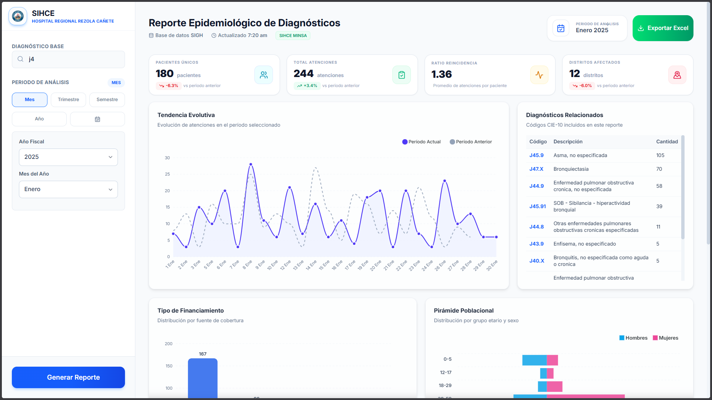
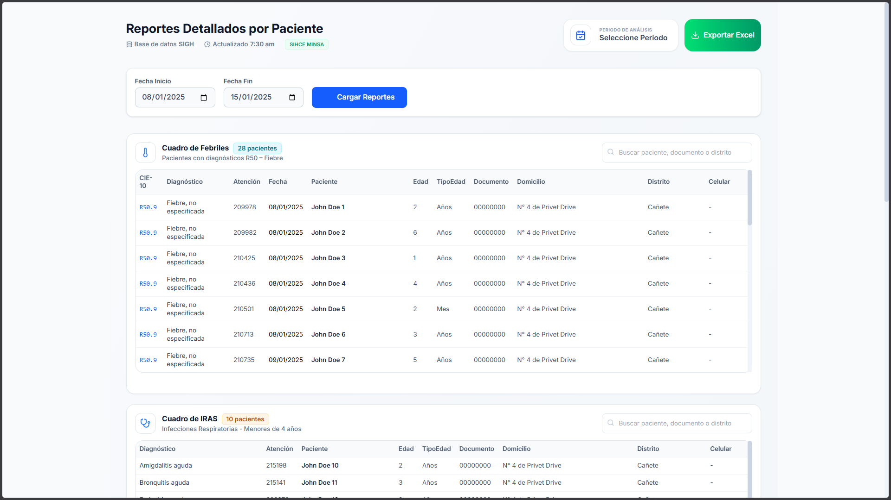

# SIHCE - Reporte Epidemiológico de Diagnósticos

Un visor de datos analíticos y reportes epidemiológicos construido con una arquitectura monolítica moderna, rápida y ligera, enfocada en la renderización desde el servidor.

## Vistas Principales

| Dashboard Principal | Reportes Detallados |
| :---: | :---: |
| *Vista principal con KPIs, gráficos y filtros interactivos.* | *Tablas detalladas de pacientes con filtros por fechas.* |
|  |  |

---

## 🚀 Stack Tecnológico y Arquitectura

Este proyecto utiliza una arquitectura monolítica **Server-First**, donde el servidor se encarga de la lógica de negocio y la renderización de HTML. El cliente es ligero y se actualiza de forma declarativa, minimizando la cantidad de JavaScript.

        

-   **Arquitectura Server-First:** La aplicación no es una SPA. El servidor genera el HTML directamente usando el motor de plantillas **Eta**.
-   **Enrutamiento Ligero:** Se utiliza **Hono.js** como enrutador principal en el servidor, conocido por su alto rendimiento y bajo consumo de memoria.
-   **Interactividad Declarativa:**
    -   **HTMX** gestiona toda la comunicación AJAX. En lugar de escribir `fetch` en JavaScript, los elementos HTML declaran qué endpoints consumir y dónde renderizar la respuesta, usualmente un parcial de HTML.
    -   **Alpine.js** se encarga de la interactividad local de la UI (mostrar/ocultar elementos, gestionar el estado de los formularios) sin necesidad de un framework de frontend pesado.
-   **Base de Datos:** La información se obtiene desde una base de datos **Microsoft SQL Server**.

## ⚙️ Cómo Funciona

1.  **Renderizado Inicial:** Al solicitar una página, el servidor Node.js/Hono compila una plantilla de Eta y la devuelve como una página HTML completa.
2.  **Actualizaciones Parciales (HTMX):** Al interactuar con filtros (ej. cambiar fechas y generar un reporte), HTMX envía una petición al endpoint correspondiente (ej. `/api/datos-dashboard`).
3.  **Respuesta del Servidor:** El servidor procesa la petición, obtiene los datos de SQL Server y renderiza **únicamente el fragmento de HTML** necesario (un parcial de Eta).
4.  **Intercambio en el DOM:** HTMX recibe este fragmento y lo "intercambia" en el lugar correspondiente del DOM, actualizando la UI sin recargar la página.
5.  **Estado Local (Alpine.js):** Alpine.js maneja el estado de los controles del formulario (qué fecha está seleccionada, qué modo de período está activo, etc.) y la visibilidad de componentes como el menú lateral en móviles.

## 📦 Instalación y Puesta en Marcha

Sigue estos pasos para ejecutar el proyecto en tu entorno de desarrollo.

### Prerrequisitos
-   Node.js (v18 o superior)
-   PNPM
-   Acceso a una instancia de Microsoft SQL Server.

### Pasos

1.  **Clonar el repositorio:**
    ```bash
    git clone https://github.com/FernandoYZ/rezola-reporte-diagnosticos
    cd rezola-reporte-diagnosticos
    ```

2.  **Configurar variables de entorno:**
    -   Crea una copia del archivo `.env.example` y renómbrala a `.env`.
    -   Modifica el archivo `.env` con las credenciales y la configuración de tu base de datos y servidor local.

    ```dotenv
    # .env
    PORT=3000
    HOST=localhost
    NODE_ENV=development

    DB_USER=tu_usuario_sql
    DB_PASSWORD=tu_contraseña_sql
    DB_SERVER=localhost
    DB_PORT=1433
    DB_NAME=SIGH
    ```

3.  **Instalar dependencias:**
    ```bash
    pnpm install
    ```

4.  **Ejecutar el servidor de desarrollo:**
    ```bash
    pnpm run dev
    ```

5.  **Abrir en el navegador:**
    -   La aplicación estará disponible en `http://localhost:3000` (o el puerto que hayas configurado).